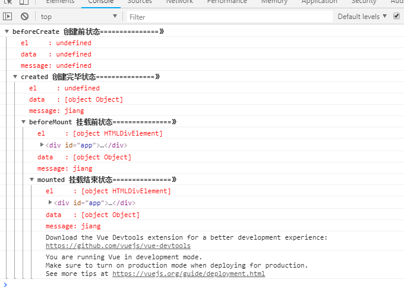
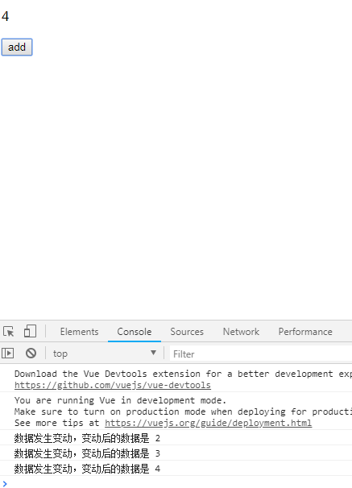
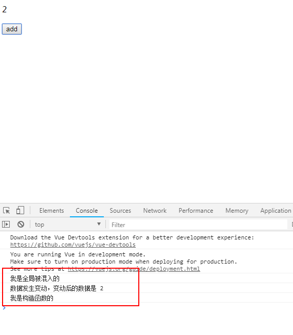
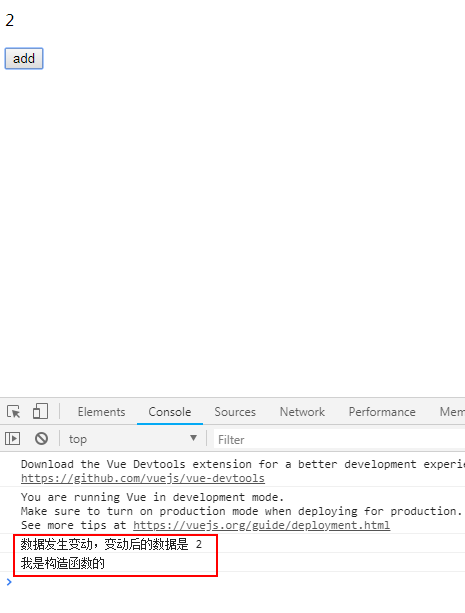
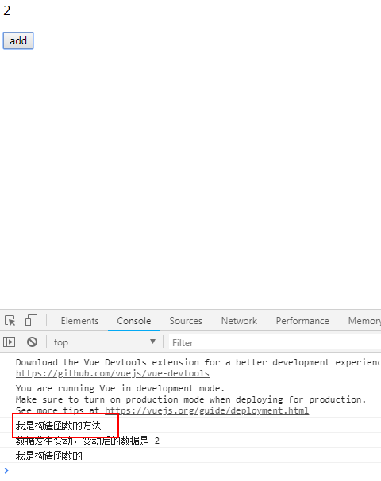
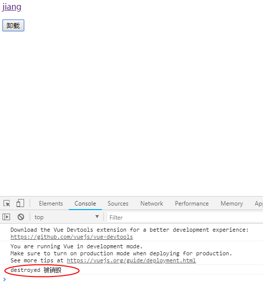
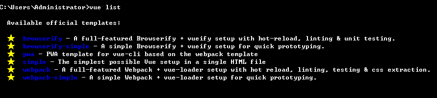

vue官网学习：https://cn.vuejs.org/v2/guide/index.html  
[基本指令](http://jspang.com/2017/02/23/vue2_01/)  
# v-model  
v-model指令，我理解为绑定数据源。就是把数据绑定在特定的表单元素上，可以很容易的实现双向数据绑定。  
*注意*  
有几个修饰符  
- .lazy：取代 imput 监听 change 事件。就是在文本输入的过程中数据绑定不会立即改变，当文本失去焦点blur的时候，数据源就会立刻改变。   
- .number：输入字符串转为数字。这里主要是将输入的数字，一般情况js会作为字符串处理，给了这个修饰符后，就会作为数字类型的值来处理，当然输入的字符如果不是数字，那还是字符串。
这个主要用在数字输入的文本框里。  
- .trim：输入去掉首尾空格。  
*js如何判断是数字*  
[js中判断一个变量是否为数字类型的疑问](https://www.cnblogs.com/yyzyxy/p/7193577.html)  
所以判断一个变量是否为数字类型，应该使用：typeof value === 'number'  
# v-bind  
v-bind是处理HTML中的标签属性的，例如<div></div>就是一个标签，也是一个标签，我们绑定上的src进行动态赋值。  
```html

```
简写  
```html

```
在实际工作中，我们主要使用一些逻辑来渲染不同的样式。  
Vue的实例代码：  
```js
let app=new Vue({
        el:"#app",
        data:{
            imgSrc:"http://7xjyw1.com1.z0.glb.clouddn.com/bbbb_20180818070432.png",
            divClass:"classA",
            isOk:false,
            v_classA:"classA",
            v_classA:"classB",
             styleObj:{fontSize:"14px",color:"gray"}
        }

    });
```
- 直接绑定样式  
```html
<div :class="v_classA">直接绑定class</div>
```
- 条件绑定样式  
```html
<div :class="{classA:isOk,classB:!isOk}">绑定class条件判断</div>
```
*注意*classA和classB是样式不是vue里data中的变量  
```html
<div :class="isOk?v_classA:v_classA">4、绑定class中的三元表达式判断</div>
```  
*注意*和上面的区别
- class数组
```html
<div :class="[v_classA,v_classA]">绑定class数组</div>  
```
- 绑定style  
错误的写法。我经常犯得错  
```html
<div :style="font-size:v_fontSize;color:v_color">绑定style</div>
```
上面的错误示例有基础需要注意的。  
vue中样式的绑定不能按照常规的html的style格式来书写，需要写成对象的形式，即（<div :style="{font-size:v_fontSize;color:v_color}">绑定style</div>）
这样还是有问题的，vue对样式的属性不能加-的（算是vue的bug吧，无法解析），需要更改为驼峰似的命名即（<div :style="{fontSize:v_fontSize;color:v_color}">绑定style</div>）  
正确的写法：  
```html
<div :style="{fontSize:v_fontSize,color:v_color}">绑定style</div>
```
当然也可以作为一个对象来绑定。  
```html
<div :style="styleObj">绑定style对象</div>
```
# v-pre  
就是原样输出  
```html
<div id="app">
    <div v-pre>{{message}}</div>
</div>
<script>
    var app=new Vue({
        el:"#app",
        data:{
            message:"jiang"
        }
    });
</script>
```
如上面，他并不会将message的内容输出，而是直接在页面上显示{{message}}  
# v-cloak  
在vue渲染完指定的整个DOM后才进行显示。它必须和CSS样式一起使用，
# v-once  
在vue只渲染一次，当绑定的数据源再次发生变化时，他也不会变化。  
```html
<div id="app">
    <div v-once>{{message}}</div>
    <input type="text" v-model="message">
    <div>{{message}}</div>
</div>
<script>
    var app=new Vue({
        el:"#app",
        data:{
            message:"jiang"
        }
    });
</script>
```
上面div的内容就不会随文本框输入的值变化而变  
# v-text  
注意使用v-text的细节  
```html
<li v-for="view in viewGroup.metricViews" v-text="view.viewName">
                            <span>jiang</span>
                        </li>
```
如果这样使用，那么标签的span标签将会被覆盖，不会生效。需要改为采用{{}}双大括号的形式。  
```html
<li v-for="view in viewGroup.metricViews">{{view.viewName}}
                            <span>jiang</span>
                        </li>
```
# Vue全局API  
## vue.directive  
*问题*  
```html
<div id="app">
    <div>{{num}}</div>
    <button @click="add">add</button>
</div>
<script>
    new Vue({
        el:"#app",
        data:{
            num:10
        },
        methods:{
            add:function() {
                debugger
                this.num++;
            }
        }
    });
</script>
```
这样写点击按钮，num会加1并在页面显示。完全符合预期。  
```html
<div id="app">
    <div>{{num}}</div>
    <button @click="add">add</button>
</div>
<script>
    new Vue({
        el:"#app",
        data:{
            num:10
        },
        methods:{
            add:()=> {
                debugger
                this.num++;
            }
        }
    });
</script>
```
但是改用es6的箭头函数，就出现问题了。debugger发现this的指向变了，上面的this是Vue，而下面的确实window。  
[this 指向详细解析（箭头函数）](https://www.cnblogs.com/dongcanliang/p/7054176.html)  
作为方法的箭头函数this指向全局window对象，而普通函数则指向调用它的对象.所以在vue中使用箭头函数要注意this的指向  
<code>
    那这样在Vue里岂不是只能使用普通函数来写了，应该会有其他方法使用箭头函数吧
</code>  
箭头函数里面的 this 是一个常量，它继承自外围作用域  
[代码重构_使用箭头函数精简你的 Vue 模块](http://imweb.io/topic/5848d21b9be501ba17b10a99)   
自定义指令示例：
```html
<div id="app">
    <div v-jiang="color">{{num}}</div>
    <button @click="add">add</button>
</div>
<script>
    Vue.directive("jiang",(el,binding)=>{
        el.style.color=binding.value;
    });
    new Vue({
        el:"#app",
        data:{
            num:10,
            color:"red"
        },
        methods:{
            add() {
                this.num++;
            }
        }
    });
</script>
```
1.自定义指令传递三个参数  
- el: 指令所绑定的元素，可以用来直接操作DOM。  
- binding:  一个对象，包含指令的很多信息。  
```js
binding:{
    name:'指令名，不包括 v- 前缀。',
    value:'指令的绑定值，例如：v-my-directive="1 + 1" 中，绑定值为 2。',
    oldValue:'指令绑定的前一个值，仅在 update 和 componentUpdated 钩子中可用。无论值是否改变都可用。',
    expression:"字符串形式的指令表达式。例如 v-my-directive="1 + 1" 中，表达式为 "1 + 1"",
    arg："传给指令的参数，可选。例如 v-my-directive:foo 中，参数为 "foo"",
    modifiers:"一个包含修饰符的对象。例如：v-my-directive.foo.bar 中，修饰符对象为 { foo: true, bar: true }。",
    vnode:"Vue 编译生成的虚拟节点。",
    oldVnode:"上一个虚拟节点"
   }
```
- vnode: Vue编译生成的虚拟节点。  
2.自定义指令的生命周期  
自定义指令有五个生命周期（也叫钩子函数），分别是 bind,inserted,update,componentUpdated,unbind  
- bind:只调用一次，指令第一次绑定到元素时调用，用这个钩子函数可以定义一个绑定时执行一次的初始化动作。  
- inserted:被绑定元素插入父节点时调用（父节点存在即可调用，不必存在于document中）。  
- update:被绑定于元素所在的模板更新时调用，而无论绑定值是否变化。通过比较更新前后的绑定值，可以忽略不必要的模板更新。  
- componentUpdated:被绑定元素所在模板完成一次更新周期时调用。  
- unbind:只调用一次，指令与元素解绑时调用。  
示例代码：  
```html
<div id="app">
    <div v-jiang="color">{{num}}</div>
    <button @click="add">add</button>
    <div>
        <button id="btn">解绑</button>
    </div>
</div>
<script>
    Vue.directive("jiang",{
        bind:function(el,binging){//被绑定
            console.log('1 - bind');
            el.style.color=binging.value;
        },
        inserted:function(){//绑定到节点
            console.log('2 - inserted');
        },
        update:function(){//组件更新
            console.log('3 - update');
        },
        componentUpdated:function(){//组件更新完成
            console.log('4 - componentUpdated');
        },
        unbind:function(){//解绑
            console.log('5 - unbind');
        }
    });
    let app=new Vue({
        el:"#app",
        data:{
            num:10,
            color:"red"
        },
        methods:{
            add() {
                this.num++;
            },
        }
    });
    window.onload=()=>{
        document.getElementById("btn").addEventListener("click",()=>{
            app.$destroy();
        })
    };
</script>
```
[指令的实用场景](https://blog.csdn.net/baidu_31333625/article/details/70473839)  
[自定义指令的详细开发](https://segmentfault.com/a/1190000012566413)   
## Vue.extend  
Vue.extend 返回的是一个“扩展实例构造器”,也就是预设了部分选项的Vue实例构造器。经常服务于Vue.component用来生成组件，可以简单理解为当在模板中遇到该组件名称作为标签的自定义元素时，
会自动调用“扩展实例构造器”来生产组件实例，并挂载到自定义元素上。  
- 自定义无参数标签  
我们想象一个需求，需求是这样的，要在博客页面多处显示作者的网名，并在网名上直接有链接地址。我们希望在html中只需要写<author></author> ，这和自定义组件很像，但是他没有传递任何参数，只是个静态标签。  
我们的Vue.extend该登场了，我们先用它来编写一个扩展实例构造器。代码如下：  
```js
let authorExpend=Vue.extend({
        template:`<p><a :href="authorUrl">{{authorName}}</a></p>`,
        data(){
            return {
                authorUrl:"http://baidu.com",
                authorName:"jiang"
            };
        }
    });
```
这时html中的标签还是不起作用的，因为扩展实例构造器是需要挂载的，我们再进行一次挂载。  
```js
new authorExpend().$mount("author");
```
这里可以是标签，class或id  
个人觉得这个没什么用，这样的需求我们一般都是采用的组件开发。   
## vue.set  
其他功能都不重要，都可以有其他方式来实现，但是对数组的数据更新或长度变化，vue是检查不到变化的，所以dom也不会更新，这样就会出现视图和数据源的不一致。需要通过vue.set来解决。  
可以查看下面数据不更新（#vue_set）  
```html
<div id="app">
    <div>
        <ul>
            <li v-for="v in arr">{{v}}</li>
        </ul>
    </div>
    <button onclick="update()">update</button>
</div>
<script>
    function update(){
//        outData.arr[1]="dddddddd";
        Vue.set(app.arr,1,"ddddddddd");
    }
    let outData={
        arr:["a","b","c"]
    };
    let app=new Vue({
        el:"#app",
        data:outData
    });
</script>
```
<code>发现没：为什么是app.arr,而不是app.data.arr</code>这个应该要看vue是怎么实例化的  
## vue生命周期  
[vue生命周期](https://juejin.im/post/5a3200f96fb9a0450a675c9a)  
组件生命周期函数的定义：从组件被创建，到组件挂载到页面上运行，再到页面关闭组件被卸载，这三个阶段总是伴随着组件各种各样的事件，那么这些事件，统称为组件的生命周期函数！  
- 生命周期的钩子函数：框架提供的函数，能够让开发人员的代码，参与到组件的生命周期中。也就是说，通过钩子函数，就可以控制组件的行为  
- 注意：vue再执行过程中会自动调用生命周期钩子函数，我们只需要提供这些钩子函数即可  
- 注意：钩子函数的名称都是固定的！！！  
vue的声明周期有beforeCreate，created，beforeMount，mounted，beforeUpdate，updated，beforeDestroy，destroyed。还有activated和deactivated，这10个钩子函数.  
- beforeCreate  
> - 说明：在实例初始化之后，数据观测 (data observer) 和 event/watcher 事件配置之前被调用  
> - 注意：此时，无法获取 data中的数据、methods中的方法

- created  
> - 说明：实例已经创建完成之后被调用。在这一步，实例已完成以下的配置：数据观测(data observer)，属性和方法的运算， watch/event 事件回调。然而，挂载阶段还没开始，$el 属性目前不可见。  
> - 注意：这是一个常用的生命周期，可以调用methods中的方法、改变data中的数据,并且修改可以通过vue的响应式绑定体现在页面上、获取computed中的计算属性等等。  
> - 使用场景：发送请求获取数据(但是也有很多人实在mounted中发送请求来改变data中的数据的，至于使用那种需要估量).值得注意的是，这个周期中是没有什么方法来对实例化过程进行拦截的。
因此假如有某些数据必须获取才允许进入页面的话，并不适合在这个页面发请求。建议在组件路由勾子beforeRouteEnter中来完成。  

- beforeMount  
> - 说明：在挂载开始之前被调用  

- mounted  
> - 此时，vue实例已经挂载到页面中，可以获取到el中的DOM元素，进行DOM操作  
- beforeUpdate  
> - 说明：数据更新时调用，发生在虚拟 DOM 重新渲染和打补丁之前。你可以在这个钩子中进一步地更改状态，这不会触发附加的重渲染过程。  
- updated  
> - 说明：组件 DOM 已经更新，所以你现在可以执行依赖于 DOM 的操作。  
- beforeDestroy  
> - 说明：实例销毁之前调用。在这一步，实例仍然完全可用。  
> - 使用场景：实例销毁之前，执行清理任务，比如：清除定时器等  
- destroyed  
> - 说明：Vue 实例销毁后调用。调用后，Vue 实例指示的所有东西都会解绑定，所有的事件监听器会被移除，所有的子实例也会被销毁。  

[vue生命周期代码示例](https://segmentfault.com/a/1190000008010666)  
```html
<div id="app">
    <div id="message_div">{{message}}</div>
</div>
<script>
    let app=new Vue({
        el:"#app",
        data:{
            message:"jiang"
        },

        beforeCreate: function () {
            console.group('beforeCreate 创建前状态===============》');
            console.log("%c%s", "color:red" , "el     : " + this.$el); //undefined
            console.log("%c%s", "color:red","data   : " + this.$data); //undefined
            console.log("%c%s", "color:red","message: " + this.message)
        },
        created: function () {
            console.group('created 创建完毕状态===============》');
            console.log("%c%s", "color:red","el     : " + this.$el); //undefined
            console.log("%c%s", "color:red","data   : " + this.$data); //已被初始化
            console.log("%c%s", "color:red","message: " + this.message); //已被初始化
        },
        beforeMount: function () {
            console.group('beforeMount 挂载前状态===============》');
            console.log("%c%s", "color:red","el     : " + (this.$el)); //已被初始化
            console.log(this.$el);
            console.log("%c%s", "color:red","data   : " + this.$data); //已被初始化
            console.log("%c%s", "color:red","message: " + this.message); //已被初始化
        },
        mounted: function () {
            console.group('mounted 挂载结束状态===============》');
            console.log("%c%s", "color:red","el     : " + this.$el); //已被初始化
            console.log(this.$el);
            console.log("%c%s", "color:red","data   : " + this.$data); //已被初始化
            console.log("%c%s", "color:red","message: " + this.message); //已被初始化
        },
        beforeUpdate: function () {
            console.group('beforeUpdate 更新前状态===============》');
            console.log("%c%s", "color:red","el     : " + this.$el);
            console.log(this.$el);
            console.log("%c%s", "color:red","data   : " + this.$data);
            console.log("%c%s", "color:red","message: " + this.message);
        },
        updated: function () {
            console.group('updated 更新完成状态===============》');
            console.log("%c%s", "color:red","el     : " + this.$el);
            console.log(this.$el);
            console.log("%c%s", "color:red","data   : " + this.$data);
            console.log("%c%s", "color:red","message: " + this.message);
        },
        beforeDestroy: function () {
            console.group('beforeDestroy 销毁前状态===============》');
            console.log("%c%s", "color:red","el     : " + this.$el);
            console.log(this.$el);
            console.log("%c%s", "color:red","data   : " + this.$data);
            console.log("%c%s", "color:red","message: " + this.message);
        },
        destroyed: function () {
            console.group('destroyed 销毁完成状态===============》');
            console.log("%c%s", "color:red","el     : " + this.$el);
            console.log(this.$el);
            console.log("%c%s", "color:red","data   : " + this.$data);
            console.log("%c%s", "color:red","message: " + this.message)
        }

    });
</script>
```
运行上面的代码你会发现  
  
从图中可以看出加载完页面，会经历4个钩子函数beforeCreate ，created ，beforeMount ，mounted 。   
在beforeCreate中无法获取 data中的数据、methods中的方法和模板的el，在created可以获取data和method的方法，但是模板的el还是无法获取（当然对文档的节点是不可能操作的）;
在beforeMount 中模板已经可以看到了，只是对于数据部分的渲染还没有；在mounted 才将Vue里data数据渲染好。  
*vue的生命周期有这些钩子函数，那我们应该如何使用了*  
> beforeCreate:可以在次加loading效果，但是有的是在created钩子函数里加loading效果  
> created :在这结束loading(我觉得结束loading效果可以放到mounted钩子函数做比较好)，还做一些初始化，实现函数自执行  
> mounted ： 在这发起后端请求，拿回数据，配合路由钩子做一些事情  
> beforeDestroy： 你确认删除XX吗？ destroyed ：当前组件已被删除，清空相关内容  
*对于发送请求是放在created,还是放在mounted。这个要看请求前和请求后是否有对文档的操作，如果有就必需在mounted里；否则就任选一个*  
*一个标准的工程项目中，会有多少个生命周期勾子吗？让我们来一起来盘点一下：*<code>很多我们后期学习</code>
1.根组件实例：8个 (beforeCreate、created、beforeMount、mounted、beforeUpdate、updated、beforeDestroy、destroyed)  
2.组件实例：8个 (beforeCreate、created、beforeMount、mounted、beforeUpdate、updated、beforeDestroy、destroyed)  
3.全局路由钩子：2个 (beforeEach、afterEach)  
4.组件路由钩子：3个 (beforeRouteEnter、beforeRouteUpdate、beforeRouteLeave)  
5.指令的周期： 5个 (bind、inserted、update、componentUpdated、unbind)  
6.beforeRouteEnter的next所对应的周期  
7.nextTick所对应的周期  
[ vue生命周期探究（一）](https://segmentfault.com/a/1190000008879966#articleHeader10)  

## template制作模板  
模板的制作有4中方法:  
1.直接在选项里使用  
```html
<div id="app"></div>
<script>
    let app=new Vue({
        el:"#app",
        template:`
            <div>这是选项模板</div>
        `
    });
</script>
```
2.使用template标签*注意：标签名是固定的*  
```html
<div id="app"></div>
<template id="template_2">
    <div>这个template模板</div>
</template>
<script>
    let app=new Vue({
        el:"#app",
        template:"#template_2"
    });
</script>
```
3.使用script标签*经实践，script的type可以不写或写任意值都可以*  
```html
<div id="app"></div>
<script type="text/x-handlebars-template" id="template_3">
    <div>这是script标签</div>
</script>
<script>
    let app=new Vue({
        el:"#app",
        template:"#template_3"
    });
</script>
```
4.学习vue-cli的时候，在进行讲述  
## component 组件  
组件就是自定义标签,组件必需要在Vue实例化里才会被正确使用，不再vue实例化内是无效的  
1.全局注册组件  
该组件在任何Vue实例化内都可以使用  
```html
<div id="app">
    <jiang></jiang>
</div>
<script>
    Vue.component("jiang",{
        template:`<div>全局组件</div>`
    });
    Vue.component("jiang2",{
        template:`<div>全局组件2</div>`
    });
    let app=new Vue({
        el:"#app"
    });
</script>
```
2.局部组件  
该组件只能在指定的Vue实例里使用  
```html
<div id="app">
    <jiang3></jiang3>
</div>
<script>
    let app=new Vue({
        el:"#app",
        components:{
            "jiang3":{
                template:`<div>局部组件3</div>`
            },
            "jiang4":{
                template:`<div>局部组件4</div>`
            }
        }
    });
</script>
```
*注意：局部和全局的单词有区别，全局是component，局部是components。*  
Vue.component一次只能注册一个全局组件，注册多个，必需要用多次。  
```js
Vue.component("jiang",{
        template:`<div>全局组件</div>`
    });
    Vue.component("jiang2",{
        template:`<div>全局组件2</div>`
    });
```
局部的components可以直接注册多个  
```js
let app=new Vue({
        el:"#app",
        components:{
            "jiang3":{
                template:`<div>局部组件3</div>`
            },
            "jiang4":{
                template:`<div>局部组件4</div>`
            }
        }
    });
```
*指令与组件的区别：*
> 组件注册的是一个标签，而指令注册的是已有标签里的一个属性。在实际开发中我们还是用组件比较多，指令用的比较少。因为指令看起来封装的没那么好，这只是个人观点。  

### 属性props
主要是获取自定义标签上的属性值  
```html
<div id="app">
    <jiang3 :msg="message"></jiang3>
</div>
<script>
    let app=new Vue({
        el:"#app",
        data:{
            message:"jiang"
        },
        components:{
            "jiang3":{
                template:`<div>局部组件3{{msg}}</div>`,
                props:["msg"]
            }
        }
    });
</script>
```
props:["msg"]里的声明必需和组件jiang3里的属性一致。这里将Vue里message数据赋值给了jiang3组件里msg属性  
对于“-”，采用小驼峰写法。如：<jiang3 data-msg="message"></jiang3>,那么props:["dataMsg"]。  
### 父子组件  
```html
<div id="app">
    <jiang3></jiang3>
</div>
<script>
    let subTest={
        template:`<div>sub……</div>`
    };
    let jiang3={
        template:`
            <div>
                <p>局部组件3</p>
                <subTest></subTest>
            </div>
        `,
        components:{
            subTest
        }
    };
    let app=new Vue({
        el:"#app",
        data:{
            message:"jiang"
        },
        components:{
            jiang3
        }
    });
</script>
```
组件的命名组号不要和html标签重名，否则vue解析会有问题。（踩过的坑都知道）  
### component标签  
可以用来控制需要显示哪个组件，以前我好像想到用v-if条件来判断的.<component></component>标签是Vue框架自定义的标签，它的用途就是可以动态绑定我们的组件，根据数据的不同更换不同的组件。    
```html
<div id="app">
    <component :is="who"></component>
    <button @click="change">switch</button>
</div>
<script>
    let subTest={
        template:`<div>sub……</div>`
    };
    let jiang3={
        template:`
            <div>
                <p>局部组件3</p>
            </div>
        `,
        components:{
            subTest
        }
    };
    let app=new Vue({
        el:"#app",
        data:{
            who:"jiang3"
        },
        components:{
            jiang3,
            subTest
        },
        methods:{
            change(){
                if(this.who==="jiang3"){
                    this.who="subTest";
                }
                else{
                    this.who="jiang3";
                }
            }
        }
    });
</script>
```
# vue 选项  
## propsData   
propsData 不是和属性有关，他用在全局扩展时进行传递数据。  
```html
<div>
    <author></author>
</div>
<script>
    let authorExpend=Vue.extend({
        template:`<p><a :href="authorUrl">{{authorName}}</a></p>`,
        data(){
            return {
            };
        },
        props:["authorUrl","authorName"]
    });
    new authorExpend({propsData:{authorUrl:"www.baidu.com",authorName:"jiang"}}).$mount("author");
</script>
```
用propsData三步解决传值:  
1.在全局扩展里加入props进行接收.props:["authorUrl","authorName"]  
2.传递时用propsData进行传递.new authorExpend({propsData:{authorUrl:"www.baidu.com",authorName:"jiang"}}).$mount("author");  
3.用插值的形式写入模板。template:`<p><a :href="authorUrl">{{authorName}}</a></p>`,  
## computed  
(这个常用)computed 的作用主要是对原数据进行改造输出。改造输出：包括格式的编辑，大小写转换，顺序重排，添加符号……。  
## methods  
- methods中参数的传递  
使用方法和正常的javascript传递参数的方法一样，分为两部：  
>1.在methods的方法中进行声明，比如我们给add方法加上一个num参数，就要写出add:function(num){}  
>2.调用方法时直接传递，比如我们要传递2这个参数，我们在button上就直接可以写。<button @click=”add(2)”></button>.  

```html
<div id="app">
    <div>
        <div>{{num}}</div>
        <button @click="add(2)">add</button>
    </div>
</div>
<script>
    let app=new Vue({
        el:"#app",
        data:{
            num:1
        },
        methods:{
            add(num){
                this.num+=num;
            }
        }
    });
</script>
```
- methods中的$event参数  
传递的$event参数都是关于你点击鼠标的一些事件和属性。我们先看看传递的方法。  
传递：<button @click=”add(2,$event)”>add</button> 。  
可以自己试着打印出来看看（我记得angular也是这样的）  
- native  给组件绑定构造器里的原生事件。  
在实际开发中经常需要把某个按钮封装成组件，然后反复使用，如何让组件调用构造器里的方法，而不是组件里的方法。就需要用到我们的.native修饰器了。  
```html
<div id="app">
        <div>{{num}}</div>
        <jiang @click.native="add(2)"></jiang>
    </div>
    <script>
        let jiang={
            template:"<button>jiang</button>"
        };
        let app=new Vue({
            el:"#app",
            data:{
                num:1
            },
            methods:{
                add(num){
                    this.num+=num;
                },

            },
            components:{
                jiang
            }
        });
    </script>
```
- 作用域外部调用构造器里的方法  
这种不经常使用，如果你出现了这种情况，说明你的代码组织不够好。  
```html
<button onclick="app.add(4)" >外部调用构造器里的方法</button>
```
## Watch   
数据变化的监控经常使用  
```html
<div id="app">
    <p>{{temprater}}</p>
    <p>{{tempraterDec}}</p>
    <div>
        <button @click="add">升温</button>
        <button @click="mus">降温</button>
    </div>
</div>
<script>
    let app=new Vue({
        el:"#app",
        data:{
            temprater:10,
            tempraterDec:""
        },
        methods:{
            add(){
                this.temprater+=5;
            },
            mus(){
                this.temprater-=5;
            }
        },
        watch:{
            temprater(){
                if(this.temprater>26){
                    this.tempraterDec="穿断续";
                }
                else if(this.temprater>=10 && this.temprater<=26){
                    this.tempraterDec="穿甲乙";
                }
                else{
                    this.tempraterDec="穿棉袄";
                }
            }
        }
    });
</script>
```
这里的watch在组件首次加载是不会执行的，只有在页面操作中当数据变化的时候才会执行。  
有些时候我们会用实例属性的形式来写watch监控。也就是把我们watch卸载构造器的外部，这样的好处就是降低我们程序的耦合度，使程序变的灵活。  
```html
<div id="app">
    <p>{{temprater}}</p>
    <p>{{tempraterDec}}</p>
    <div>
        <button @click="add">升温</button>
        <button @click="mus">降温</button>
    </div>
</div>
<script>
    let app=new Vue({
        el:"#app",
        data:{
            temprater:10,
            tempraterDec:""
        },
        methods:{
            add(){
                this.temprater+=5;
            },
            mus(){
                this.temprater-=5;
            }
        }
    });
    app.$watch("temprater",function(newVal,oldVal){
        if(newVal>26){
            this.tempraterDec="穿断续";
        }
        else if(newVal>=10 && newVal<=26){
            this.tempraterDec="穿甲乙";
        }
        else{
            this.tempraterDec="穿棉袄";
        }
    });
</script>
```
*watch 和 computed区别*  
>首先它们都是以Vue的依赖追踪机制为基础的，它们的共同点是：都是希望在依赖数据发生改变的时候，被依赖的数据根据预先定义好的函数，发生“自动”的变化  
>1.watch擅长处理的场景：一个数据影响多个数据  
>2.computed擅长处理的场景：一个数据受多个数据影响  
>[watch与computed区别](https://www.jb51.net/article/120073.htm)  

## Mixins  
Mixins一般有两种用途：  
>1.在你已经写好了构造器后，需要增加方法或者临时的活动时使用的方法，这时用混入会减少源代码的污染。  
>>例如，构造函数已经写好了，需求变动不希望破坏原有已写好的构造函数。或者临时加个商品促销活动等场景。  

>2.很多地方都会用到的公用方法，用混入的方法可以减少代码量，实现代码重用。  
```html
<div id="app">
    <p>{{num}}</p>
    <div>
        <button @click="add">add</button>
    </div>
</div>
<script type="text/javascript">
    var addLog={
        updated:function(){
            console.log("数据发生变动，变动后的数据是 "+this.num);
        }
    };
    let app=new Vue({
        el:"#app",
        data:{
            num:1
        },
        methods:{
            add(){
                this.num++;
            }
        },
        mixins:[addLog]
    });
</script>
```
这样数据更新完成后都会在控制台打印一条信息。如图：  
  
我们还可以通过全局进行混入，并且他们还有执行的顺序  
```html
<div id="app">
    <p>{{num}}</p>
    <div>
        <button @click="add">add</button>
    </div>
</div>
<script type="text/javascript">
    Vue.mixin({
        updated:function(){
            console.log('我是全局被混入的');
        }
    });
    var addLog={
        updated:function(){
            console.log("数据发生变动，变动后的数据是 "+this.num);
        }
    };
    let app=new Vue({
        el:"#app",
        data:{
            num:1
        },
        methods:{
            add(){
                this.num++;
            }
        },
        updated(){
            console.log("我是构造函数的");
        },
        mixins:[addLog]
    });
</script>
```
执行结果如图：  
  
从图可以看出，全局混入的最先执行，然后是混入的，最后是构造函数的。  
-既然可以全局混入，那么每个组件（或vue实例）在执行时都会先执行全局混入的函数，我在想loading效果是不是全局混入在created函数或beforCreate函数里-  
## extends  
extends 和 mixins有点类似  
```html
<div id="app">
    <p>{{num}}</p>
    <div>
        <button @click="add">add</button>
    </div>
</div>
<script type="text/javascript">
    var addLog={
        updated:function(){
            console.log("数据发生变动，变动后的数据是 "+this.num);
        }
    };
    let app=new Vue({
        el:"#app",
        data:{
            num:1
        },
        methods:{
            add(){
                this.num++;
            }
        },
        updated(){
            console.log("我是构造函数的");
        },
        extends:addLog
    });
</script>
```
执行结果如图  
  
从图中可以看出扩展的生命周期updated先执行  
```html
<div id="app">
    <p>{{num}}</p>
    <div>
        <button @click="add">add</button>
    </div>
</div>
<script type="text/javascript">
    var addLog={
        updated:function(){
            console.log("数据发生变动，变动后的数据是 "+this.num);
        },
        methods:{
            add(){
                console.log("我是扩展函数的方法");
            }
        },
    };
    let app=new Vue({
        el:"#app",
        data:{
            num:1
        },
        methods:{
            add(){
                console.log("我是构造函数的方法");
                this.num++;
            }
        },
        updated(){
            console.log("我是构造函数的");
        },
        extends:addLog
    });
</script>
```
执行结果如图:  
  
从图中可以看出，扩展的方法里没有执行，那是因为扩展的方法名相同，也就是说同一方法优先执行构造的。mixins也是这样的，可以自己试试  

## delimiters   
delimiters的作用是改变我们插值的符号。Vue默认的插值是双大括号{{}}。但有时我们会有需求更改这个插值的形式。  
```html
<div id="app">
    <div>${message}</div>
</div>

<script>
    var app=new Vue({
        el:"#app",
        data:{
            message:"jiang"
        },
        delimiters:['${','}']
    });
</script>
```
现在我们的插值形式就变成了${}。  
# vue实例方法  
虽然有些前面已经有了，但是这里还是写一下  
## $mount  
$mount方法是用来挂载我们的扩展的  
```html
<div id="app"></div>
<script>
    let authorExpend=Vue.extend({
        template:`<p><a :href="authorUrl">{{authorName}}</a></p>`,
        data(){
            return {
                authorUrl:"http://baidu.com",
                authorName:"jiang"
            };
        }
    });
    new authorExpend().$mount("#app");
</script>
```
## $destroy  
用$destroy()进行卸载。
```html
<p><button onclick="destroy()">卸载</button></p>
```
```js
function destroy(){
        vm.$destroy();
    }
```
执行结果如图:  
  
## $forceUpdate  
$forceUpdate() 更新方法  
## $nextTick()  
当Vue构造器里的data值被修改完成后会调用这个方法，也相当于一个钩子函数吧，和构造器里的updated生命周期很像。  
这个个人觉得还是很有用的，项目中就涉及到它。  
这个更多的是用在获取dom节点更新后的数据。[$nextTick](https://zhuanlan.zhihu.com/p/26724001)  
Vue 实现响应式并不是数据发生变化之后 DOM 立即变化，而是按一定的策略进行 DOM 的更新。  
$nextTick 是在下次 DOM 更新循环结束之后执行延迟回调，在修改数据之后使用 $nextTick，则可以在回调中获取更新后的 DOM  
# vue实例事件   
$on 在构造器外部添加自定义事件。  
```js
app.$on("reduce",function(){
        this.num--;
    });
```
$on接收两个参数，第一个参数是调用时的事件名称，第二个参数是一个匿名方法。  
如果按钮在作用域外部，可以利用$emit来执行。  
```js
function reduce(){
        app.$emit("reduce");
    }
```
自定义的事件是没法在作用域里像methods里的方法那样使用的，如下面的代码就是错误的示例：  
```html
<div id="app">
    <p>{{num}}</p>
    <p>
        <button @click="add">add</button>
    </p>
    <p>
        <button @click="reduce">reduce</button>
    </p>
</div>
<!--<p>-->
    <!--<button onclick="reduce()">reduce</button>-->
<!--</p>-->
<script>
    let app=new Vue({
        el:"#app",
        data:{
            num:1
        },
        methods:{
            add(){
                this.num++;
            }
        }
    });
    app.$on("reduce",function(){
        this.num--;
    });
//    function reduce(){
//        app.$emit("reduce");
//    }
</script>
```
$once执行一次的事件  
```js
app.$once("onceClick",function(){
        alert("once");
    });
```
调用和$on一样使用  
$off关闭事件  
```js
app.$off('reduce');
```

## 父子组件之间的通信  
### 父组件向子组件通信  
父组件是使用 props 传递数据给子组件  
在父组件中   
```html
<high-chart-data-table :metricDatas="graphData.graphMetrics" :granularity="granularity"></high-chart-data-table>
```
可以知道我们传了graphData.graphMetrics和granularity给子组件了。子组件需要在自己的构造函数里声明props属性来接收就可以了。  
```js
props:['metricDatas','granularity'],
```
这样子组件就可以使用父组件传过来的数据了。   
### 子组件向父组件通信  
首先，要在父组件里监听一个事件  
```html
<metric-aside @listenerToTagEvent="tagEvent"></metric-aside>
```
子组件在特定交互情况下，触发事件，传递消息通信  
```js
tagClick(tagId){
                this.asideShow=false;
                this.selectTag=tagId;
                this.$emit('listenerToTagEvent',tagId)
            }
```

## 两个非父子组件之间的通信  
在简单的场景下，使用一个空的 Vue 实例作为中央事件总线(*那复杂场景又该如何使用呢？*)：  
```html
<div id="app">
    <p>{{num}}</p>
    <p>
        <button @click="add">add</button>
    </p>
    <p>
        <button @click="sendMsg">sendMsg</button>
    </p>
</div>

<div id="app2">
    <p>{{msg}}</p>
</div>
<p>
    <button onclick="reduce()">reduce</button>
</p>
<script>
    let bus=new Vue();
    let app=new Vue({
        el:"#app",
        data:{
            num:1
        },
        methods:{
            add(){
                this.num++;
            },
            sendMsg(){
                console.log(1);
                bus.$emit("getApp1",this.num);
            }
        }
    });

    let app2=new Vue({
        el:"#app2",
        data:{
            msg:"app2"
        },
        created(){
            let self=this;
            bus.$on("getApp1",function(num){
                console.log(2);
                self.msg=num;
            })
        }
    });
</script>
```


<a name="vue_set"></a>
# vue中修改了数据但视图无法更新的情况  
参考：http://blog.csdn.net/github_38771368/article/details/77155939  
# 组件通信  
我在父组件中需要传值给子组件，但是在最开始待传的值是没有值的，需要后面请求后才能获得值。  
```html
<div class="graph-body">
                    <graph-highchart :data="graph.graphMetricData"></graph-highchart>
                </div>
```
开始是这样写的，子组件怎么都不出来，我以为是因为数组里的对象添加了属性，导致视图没有更新的原因，于是使劲的解决这个问题可是怎么弄不好，最后将值打印出来发现视图更新了。这才醒悟是第一次没有值的原因，导致子组件加载不出来。修改代码如下：  
```html
<div class="graph-body" v-if="graph.graphMetricData">
                    <graph-highchart :data="graph.graphMetricData"></graph-highchart>
                </div>
```
# 链接的跳转  
学会使用在属性里动态拼接值  
```html
<router-link :to="{path:'metricDetail?graphId='+graph.graphId+'&title='+graph.graphName}" target="_blank">
                                <i class="wbk-ground-img-FullScr_Dft"></i>
                            </router-link>
                            <!--<a :herf="'#/metricDetail?grpahId='+graph.graphId+'&title='+graph.graphName" target="_blank">
                                <i class="wbk-ground-img-FullScr_Dft"></i>
                            </a>-->
```
不知道为什么使用下面的a标签点击不会跳转，看官网是推荐使用router-link标签.
# vue和angularjs的区别  
例如，给标签动态赋值样式  
vue
```html
<i :class="{'wbk-ground-img-Layout1_Dft':col==24,'wbk-ground-img-Layout2_Dft':col==12,'wbk-ground-img-Layout3_Dft':col==8}"></i>
```
angular  
```html
<i :class="{'wbk-ground-img-Layout1_Dft':24,'wbk-ground-img-Layout2_Dft':12,'wbk-ground-img-Layout3_Dft':8}[col]"></i>
```
# axios的使用  
https://www.kancloud.cn/yunye/axios/234845
1.在做页面中，我们会在一次交互中需要发送多个请求，这些请求需要按照一定的顺序，串行执行，在axios中这样使用：  
```js
axios(param).then(data=>{
          if(data.data.data){
            var curData = data.data.data
            globalMap.set('data',curData)
          }
          if(data.data.systemTime){
            this.systemTimes = data.data.systemTime.substring(0,16)
          }
        }).then(function () {
          self.parameterSquare()
        }).then(function () {
          self.$store.dispatch('hideSpin')
        })
```
这样就是第一次发送请求，后处理完第一个then里的逻辑之后再去处理第二个then里js函数发请求和处理逻辑。
2.如果需要并发请求，并且等到所有请求完之后，在对结果进行处理，可以采用下面的方法：  
```js
axios.all([
            axios.get("a.txt"),
            axios.get("b.txt")
    ]).then(axios.spread(function (userResp, reposResp) {

        // 上面两个请求都完成后，才执行这个回调方法

        console.log('User', userResp.data);

        console.log('Repositories', reposResp.data);

    }));
```
当后面的请求需要前一个请求的结果里的值作为参数时，我们可以采用前面的第一种方式；如果几个请求的参数没有需要其他请求的结果里的值，  
只是页面逻辑需要几个请求结果的值都有才好处理的，我们可以采用第二种方式来做；至于根本没关系的，就并发请求处理结果就可以了。  
# vuex  
官网地址：https://vuex.vuejs.org/zh-cn/  
Vuex 通过 store 选项，提供了一种机制将状态从根组件“注入”到每一个子组件中（需调用 Vue.use(Vuex)）：  
```js
const app = new Vue({
  el: '#app',
  // 把 store 对象提供给 “store” 选项，这可以把 store 的实例注入所有的子组件
  store,
  components: { Counter },
  template: `
    <div class="app">
      <counter></counter>
    </div>
  `
})
```
通过在根实例中注册 store 选项，该 store 实例会注入到根组件下的所有子组件中，且子组件能通过 this.$store 访问到。(解释我最初的疑惑)  
vuex使用场景  
vuex使用步骤：  
1.在根实例注册一个store的实例。  
2.在VUE组件中条用实例中的action。  
```js
methods:mapActions([
      'increment'/*,
      'decrement',
      'clickOdd',
      'clickAsync'*/
    ])
```
3.action将commit给mutations来处理，逻辑都在mutations里。  
可以结合项目学习：https://github.com/jiang2016tao/studyVueProject  
# vue-cli  
## npm install vue-cli -g  //全局安装vue-cli命令行工具  
## vue init webpack myProject  //创建基于webpack模板(这里也可以是其他的模板，可以使用vue list命令查看)的新项目【注意，这里项目名称myProject不能有横杠否则要报错的],这里注意下，vue build版本一般是默认的，直接enter，然后什么单元测试，eslint检查，统统直接不要，只要一个vue-router路由。
  
## cd myProject  //进入到刚刚下载的项目  
## npm install  //安装插件依赖，安装完后会在项目下面发现生成了一个node_modules文件目录。vue组件编译，es6语法编译，css语法编译...都会使用到  
## npm run dev  //运行项目，开始你的开发里程
# keep-alive  
1、keep-alive要配合router-view使用，这里要注意一点就是，keep-alive本身是vue2.0的功能，并不是vue-router的，所以再vue1.0版本是不支持的。在项目中我们有些页面需要缓存，有些页面需要及时刷新是不能使用缓存的，那要怎么自定义呢，那就要在router-view里面多加个v-if判断了，然后在router定义的文件里面在想要缓存的页面多加上“meta:{keepAlive:true}”，不想要缓存就是“meta:{keepAlive:false}”或者不写，只有为true的时候是会被keep-alive识别然后缓存的。示例代码  
```html
<keep-alive>
              <router-view v-if="$route.meta.keepAlive"></router-view>
          </keep-alive>
          <router-view v-if="!$route.meta.keepAlive"></router-view>
```
```js
{
        path: '/newHomePage/',
        component: newHomePage,
        hidden: true,
        children: [
            { path: 'metricView', component:metricView,meta:{
                keepAlive:true
                }},
            { path: 'graphSearchForm', component:graphSearchForm }
        ]
    }
```
可以看出我们是配在一个子路径下面的，如果是从根目录返回，那样是没有效果的。其实我自己尝试在根目录的路由出加上。以下代码  
```html
<keep-alive>
              <router-view v-if="$route.meta.keepAlive"></router-view>
          </keep-alive>
          <router-view v-if="!$route.meta.keepAlive"></router-view>
```
发现这样的配置是有问题的。虽然每次返回不会再重新渲染我缓存的页面了，但是每次跳转后都会重新实例化我的组件，就是跳转后缓存页面的组件会发请求。keep-alive使用后组件是不会销毁的，那么就不应该会再次调用created、mounted等这些组件声明周期的函数了，可是上面配置之后这些函数都有执行，那就说明重新实例化了组件。  
被包含在 <keep-alive> 中创建的组件，会多出两个生命周期的钩子: activated 与 deactivated  
activated  
在组件被激活时调用，在组件第一次渲染时也会被调用，之后每次keep-alive激活时被调用。  
deactivated  
在组件被停用时调用。  
注意：只有组件被 keep-alive 包裹时，这两个生命周期才会被调用，如果作为正常组件使用，是不会被调用，以及在 2.1.0 版本之后，使用 exclude 排除之后，就算被包裹在 keep-alive 中，这两个钩子依然不会被调用！另外在服务端渲染时此钩子也不会被调用的。  

----
在使用VUE组件中，我们经常希望等所有的dom元素都渲染完了，在去获取节点的对象。例如当请求到数据后，我需要根据请求的数据封装到highchart来给指定的元素展示。可是元素只有在请求到数据才会有
```js
<div v-if="hostData.length>0">
                <div id="high_chart" style="height: 270px;"></div>
                </div>
```
其实，我们可以在修改数据后调用this.$nextTick，首次加载在mounted函数里面调用this.$nextTick  
this.$nextTick(function () {  
//dom已更新  
})  
# 在vue中，我们很多情况共用页面，只是路由的参数不一样。当路由的参数不一样的时候，组件是不是重新生成或页面重新加载的。这个时候，我们应该监听路由，然后调用获取数据的方法，重绘视图。  
如：监听路由，调用重绘视图的aelInit方法。
```js
mounted(){
            this.$nextTick(function () {
                
                
                this.getDomain();
                this.getAllCitype();
                this.aelInit();
            });
        },
        watch:{
            "$route":"aelInit"
        },
```
# filter 过滤器
我们将项目中的过滤器放置在一个单独的js文件中，然后在首页index.js中进行全局注册，这样过滤器就可以在所有组件中使用，不需要引入的。  
```js
import * as filters from './utils/filters'
Object.keys(filters).forEach(key => {
    Vue.filter(key, filters[key])
});
```
当然也可以本地注册这样只能在本组件中使用，可以用“|”连续使用多个过滤器，可以为过滤器添加参数。https://www.w3cplus.com/vue/how-to-create-filters-in-vuejs.html
# vue组件中的样式属性--scoped
http://blog.csdn.net/one_girl/article/details/78737740
在使用样式发现没有生效。
```html
<el-table :data="aelData.comAlertLists" cell-class-name="span-td" class="b-c-7eb138">
  ……
  </el-table>
```
如上面我有两个样式span-td（是给表格的每个单元格的样式）和b-c-7eb138（是表格子组件的自身样式）。结果发现b-c-7eb138样式有效，span-td样式无效。  
发现是样式编写使用了scoped。<style scoped>，这样的样式只会对本组件有效，虽然本组件里有子组件，那也只是对子组件的根组件布局样式有效，子组件的根组件下的其他html节点将不会受样式的影响了。
如果想对设置了scoped的子组件里的元素进行控制可以使用’>>>’或者’deep’  
  ```html
  <metric-aside class="test-root-class" @listenerToTagEvent="tagEvent"></metric-aside>
  ```
  如果想改变子组件metric-aside的样式可以这样使用,注意test-root-class是类名。
  ```js
  .test-root-class >>> .input-div{
        background-color: #000000;
    }
  ```
  # Mock(数据的模拟)  
  在开发中，我们采用前后端分离。在没有后端时，我们前端对数据的模拟。  
  以前我都是将数据以约定的特定json格式写在文件里，然后ajax直接访问该文件这样处理。  
  今天在使用另一种方法，使用node的express。首先需要准备一个json文件，文件可以在https://github.com/jiang2016tao/vue_seller/blob/master/data.json。  
  在webpack的启动文件里添加路由设置,注意这个监听app.listen(8080)（端口号，必须和环境的服务器配置的一致）;我之前开始就没加，怎么都用连接访问不到。  
  ```js
  var express = require('express');
  var apiRoutes = express.Router();
  
  apiRoutes.get('/seller', function (req, res) {
    res.json({
      errno: 0,
      data: seller
    });
  });
  
  apiRoutes.get('/goods', function (req, res) {
    res.json({
      errno: 0,
      data: goods
    });
  });
  
  apiRoutes.get('/ratings', function (req, res) {
    res.json({
      errno: 0,
      data: ratings
    });
  });
  
  app.use('/api', apiRoutes);
  app.listen(8080);
  ```
  启动环境后，就可以测试了http://localhost:8080/api/seller
